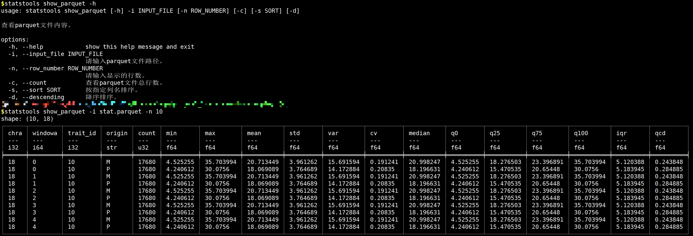

[English](README.en.md) | 简体中文

## 1 ❤️ 工具说明

首先查看工具列表：`statstools -h`，专为科学计算设计，全面处理 AppchrArrow的工具包，支持Bayes混合效应模型计算方差、组间方差、组内方差、可重复性（R=组间方差/组内方差）。

举个例子：这个工具可以查看parquet格式的文件：`statstools show_parquet -i stat.parquet -n 10`
​
