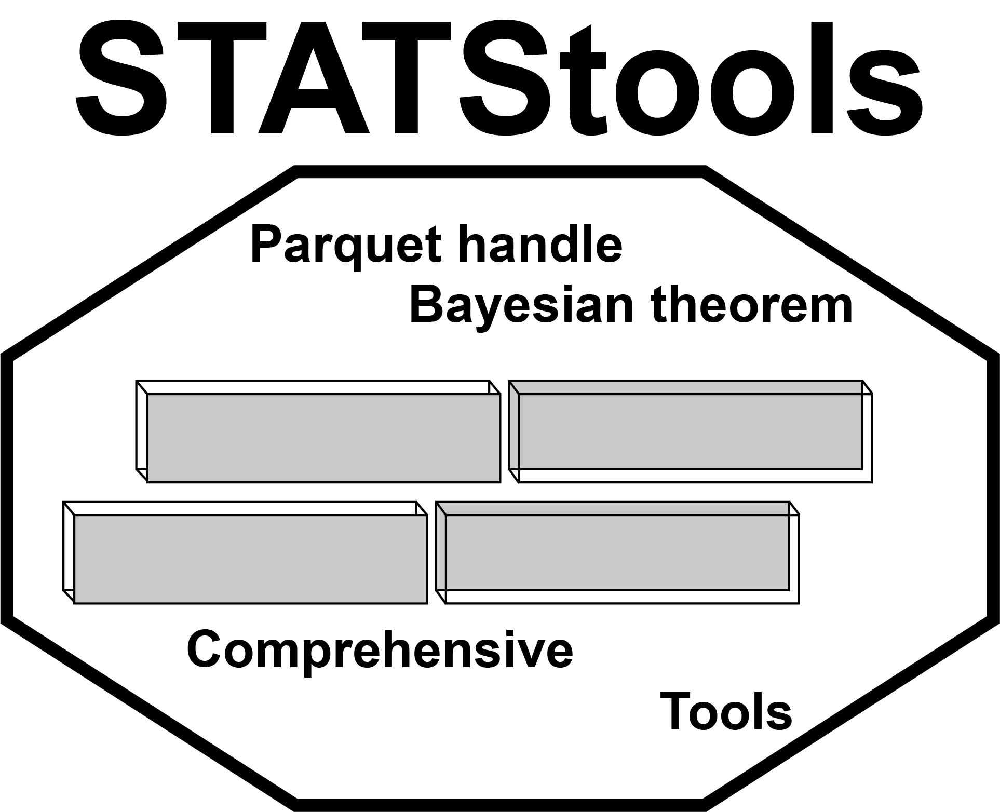
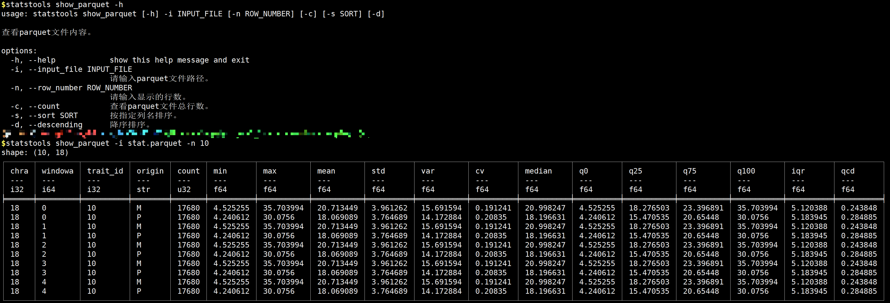

<div align="center">

[English](README.en.md) | 简体中文

​


</div>

<div align="center">
<a href="https://scholar.google.com/citations?user=zfonu1kAAAAJ&hl=en">
  
</a>
<a href="https://orcid.org/0009-0003-2969-0551">
  
</a>
<a href="https://github.com/HuTaoJiaZiAckerman">
  
</a>
</div>


## 1 ❤️ 工具说明

首先查看工具列表：`statstools -h`，专为科学计算设计，全面处理 AppchrArrow的工具包，支持Bayes混合效应模型计算方差、组间方差、组内方差、可重复性（R=组间方差/组内方差）。

举个例子：这个工具可以查看parquet格式的文件：`statstools show_parquet -i stat.parquet -n 10`

​

## 2. 安装说明

* 首先克隆本项目到本地：
* 其次创建conda环境；
* 然后进入文件夹安装软件。
```shell
git clone git@github.com:HuTaoJiaZiAckerman/STATStools.git
cd STATStools
conda create -n statstools python=3.10 -y
conda activate statstools
python -m pip install --upgrade pip
python -m pip install -e .
```
项目依赖由 `pyproject.toml` 统一管理。执行 `python -m pip install -e .` 时会自动安装全部运行依赖。


查看说明书：
`statstools -h`

## 3. 帮助页面

请查看[本地工具文档](docs/README.md)。GitHub Wiki 只保留文档导航。

## 4. 联系我
`xueshengcaominghao@163.com` 或者 `caominghao@kiz.mail.ac.cn` 。